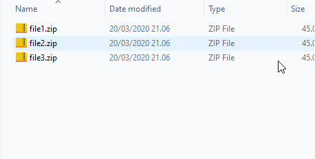

  

# Windows 10: Double click to unpack zip and rar files in windows:

Double click to extract files:

Multiselect and press ENTER key, to extract all:

Features:
* Double click to unzip, rar files and zip files. No stupid dialogs.
* Multi select files, press enter an they all unzip into there seperate directory

Install:
1. Download the "unzip.exe" from here, put it whereever you want.
2. Install the program z-zip to exactly this location: C:\Program Files\7-Zip\7z.exe
3. Follow the screenshots, do it both for zip and rar:

